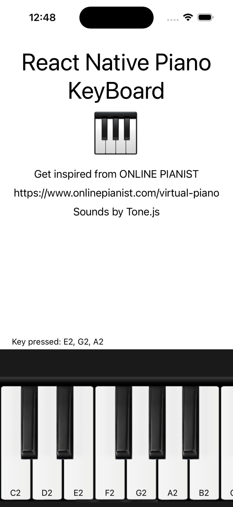
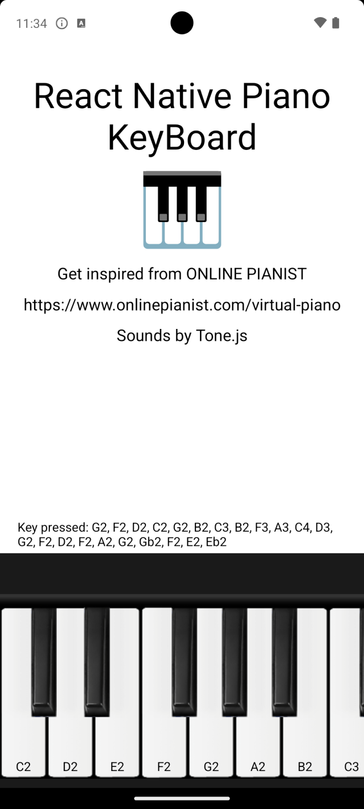
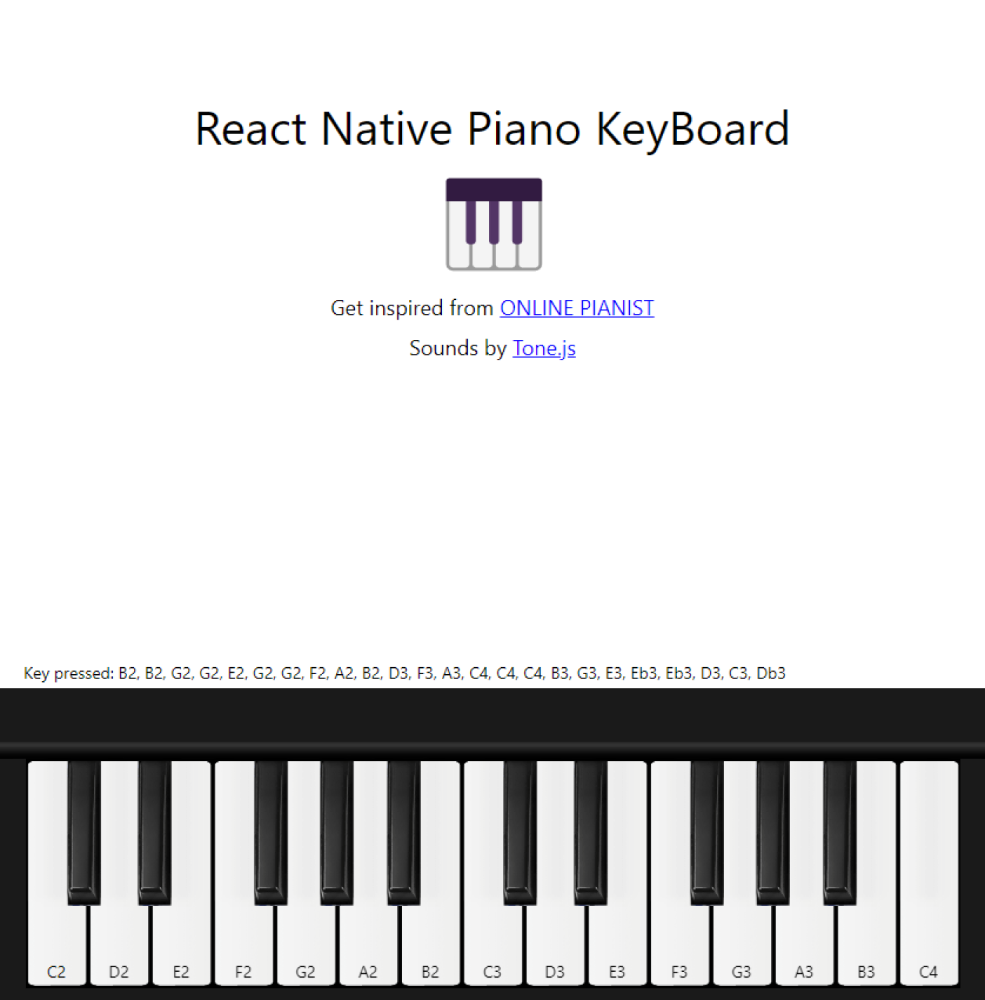

# Welcome to React Native Piano Keyboard 👋
This is an [Expo](https://expo.dev/) project and Inspired from [ONLINE PIANIST](https://www.onlinepianist.com/virtual-piano)

## ScreenShots
| iOS | Android | Web |
| ----------- | ----------- | ----------- |
|  |  |  |

## Get started
1. Install dependencies

   ```bash
   npm install
   ```

2. Start the app

   ```bash
    npm start
   ```

In the output, you'll find options to open the app in a

- [development build](https://docs.expo.dev/develop/development-builds/introduction/)
- [Android emulator](https://docs.expo.dev/workflow/android-studio-emulator/)
- [iOS simulator](https://docs.expo.dev/workflow/ios-simulator/)
- [Expo Go](https://expo.dev/go), a limited sandbox for trying out app development with Expo

Playing piano sound is implemented by using [webview](https://github.com/react-native-webview/react-native-webview) and [Tone.js](https://tonejs.github.io/).
